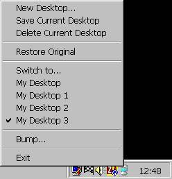



## Desk Topper

### Description

Lets you save different desktop arrangements and restore them with a mouse click.
 
### More Info
 
There are lots of useful functions and routines here - create popup menu, drag a form, count desktop icons and get/set their positions...

Just one suggestion - backup your C:\Windows\Desktop folder before using the program, just in case something goes wrong, so you can restore your desktop.

             |
---                |---
**Submitted On**   |2002-05-15 12:46:58
**By**             |[Anthony Neilsen](https://github.com/Planet-Source-Code/PSCIndex/blob/master/ByAuthor/anthony-neilsen.md)
**Level**          |Advanced
**User Rating**    |4.2 (38 globes from 9 users)
**Compatibility**  |VB 5\.0, VB 6\.0
**Category**       |[Complete Applications](https://github.com/Planet-Source-Code/PSCIndex/blob/master/ByCategory/complete-applications__1-27.md)
**World**          |[Visual Basic](https://github.com/Planet-Source-Code/PSCIndex/blob/master/ByWorld/visual-basic.md)
**Archive File**   |[Desk\_Toppe832205142002\.zip](https://github.com/Planet-Source-Code/anthony-neilsen-desk-topper__1-34798/archive/master.zip)

